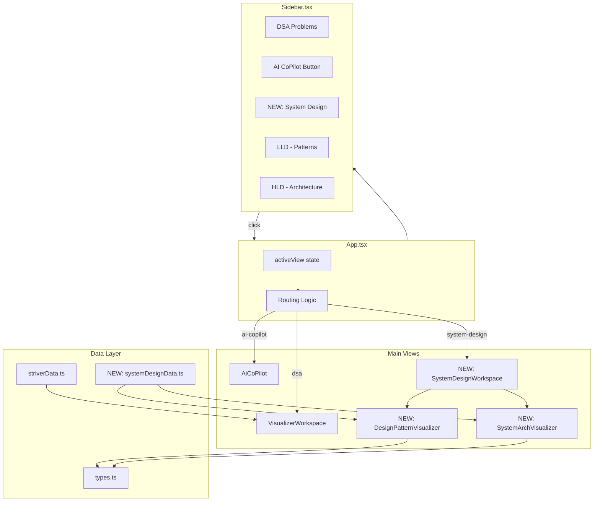

# System Design Section - Architecture Plan

## Overview

Add a **System Design** section to the Striver SDE Sheet Visualizer covering:
1. **LLD** — Creational, Structural, Behavioral design patterns with interactive class diagrams
2. **HLD** — System architecture diagrams for popular system design problems

---

## 1. Data Types

### 1.1 New Types (`src/types.ts` — append)

```typescript
// ────────────── System Design Types ──────────────

export type DesignPatternCategory = 'creational' | 'structural' | 'behavioral';

export interface DesignPattern {
  id: string;
  name: string;
  category: DesignPatternCategory;
  intent: string;                    // One-line purpose
  problem: string;                   // What problem it solves
  solution: string;                  // How it solves it
  structure: ClassRelation[];        // For class diagram rendering
  participants: ClassParticipant[];  // Classes/interfaces involved
  codeExample: string;               // TypeScript/JS code snippet
  realWorldExample: string;          // Real-world analogy
  whenToUse: string[];               // Use-case checklist
  pros: string[];
  cons: string[];
}

export interface ClassRelation {
  from: string;       // participant id
  to: string;         // participant id
  type: 'inheritance' | 'implementation' | 'composition' | 'aggregation' | 'dependency' | 'association';
  fromLabel?: string;
  toLabel?: string;
}

export interface ClassParticipant {
  id: string;
  name: string;
  type: 'class' | 'interface' | 'abstract-class';
  methods: string[];
  fields: string[];
}

export type HldComponentType =
  | 'client' | 'dns' | 'cdn' | 'load-balancer'
  | 'api-gateway' | 'web-server' | 'microservice'
  | 'cache' | 'database' | 'message-queue'
  | 'worker' | 'object-storage' | 'search-service';

export interface HldComponent {
  id: string;
  name: string;
  type: HldComponentType;
  description: string;
}

export interface HldConnection {
  from: string;
  to: string;
  label?: string;       // e.g., "HTTP", "gRPC", "reads/writes"
  protocol?: string;
  dataType?: string;    // e.g., "JSON", "binary"
}

export interface SystemDesignProblem {
  id: string;
  title: string;
  category: 'lld' | 'hld';
  description: string;
  requirements: string[];
  estimatedScale?: string;
  components: HldComponent[];
  connections: HldConnection[];
  deepDive?: string;    // Markdown explanation
  followUp?: string[];  // Discussion points
}
```

### 1.2 Color/Theme Constants (optional, `src/data/systemDesignColors.ts`)

```typescript
export const HLD_COMPONENT_COLORS: Record<HldComponentType, string> = {
  'client': '#6366f1',        // indigo
  'dns': '#8b5cf6',           // violet
  'cdn': '#d946ef',           // fuchsia
  'load-balancer': '#f59e0b', // amber
  'api-gateway': '#10b981',   // emerald
  'web-server': '#3b82f6',    // blue
  'microservice': '#06b6d4',  // cyan
  'cache': '#ef4444',         // red
  'database': '#8b5cf6',      // violet
  'message-queue': '#f97316', // orange
  'worker': '#84cc16',        // lime
  'object-storage': '#14b8a6',// teal
  'search-service': '#a855f7' // purple
};
```

---

## 2. Component Architecture

```
App.tsx
├── Sidebar (modified)
│   ├── DSA Problems (existing)
│   ├── AI CoPilot (existing)
│   └── NEW: System Design Section
│       ├── LLD - Design Patterns
│       │   ├── Creational (5 patterns)
│       │   │   ├── Singleton
│       │   │   ├── Factory Method
│       │   │   ├── Abstract Factory
│       │   │   ├── Builder
│       │   │   └── Prototype
│       │   ├── Structural (7 patterns)
│       │   │   ├── Adapter
│       │   │   ├── Decorator
│       │   │   ├── Proxy
│       │   │   ├── Facade
│       │   │   ├── Composite
│       │   │   ├── Bridge
│       │   │   └── Flyweight
│       │   └── Behavioral (8 patterns)
│       │       ├── Observer
│       │       ├── Strategy
│       │       ├── Command
│       │       ├── State
│       │       ├── Template Method
│       │       ├── Iterator
│       │       ├── Mediator
│       │       └── Chain of Responsibility
│       └── HLD - System Architecture
│           ├── URL Shortener (tinyurl)
│           ├── WhatsApp / Chat System
│           ├── Netflix / Video Streaming
│           ├── Uber / Ride Hailing
│           └── Twitter / Social Feed
│
└── Main View
    ├── VisualizerWorkspace (existing - DSA)
    ├── AiCoPilot (existing - AI Sandbox)
    └── NEW: SystemDesignWorkspace
        ├── LLD Tab
        │   ├── DesignPatternInfoCard
        │   ├── ClassDiagramRenderer (SVG)
        │   └── CodeExampleViewer
        └── HLD Tab
            ├── SystemInfoPanel
            ├── ArchitectureDiagramRenderer (SVG)
            └── ConnectionFlowLegend
```

---

## 3. File Breakdown

### CREATE: `src/data/systemDesignData.ts`
- Complete data for all design patterns (5 Creational + 7 Structural + 8 Behavioral = 20 patterns)
- Complete data for 5 HLD problems
- Exported as `SYSTEM_DESIGN_PROBLEMS` array (similar to `STRIVER_PROBLEMS`)
- Separate exports: `DESIGN_PATTERNS` and `HLD_PROBLEMS`

### CREATE: `src/components/DesignPatternVisualizer.tsx`
- Renders an interactive **class diagram** using SVG
- Shows classes/interfaces as boxes with fields/methods
- Draws relationship arrows (inheritance = hollow triangle, composition = filled diamond, etc.)
- Animated highlighting of active participant

```tsx
interface DesignPatternVisualizerProps {
  pattern: DesignPattern;
  activeParticipantId?: string;
}
```

### CREATE: `src/components/SystemArchitectureVisualizer.tsx`
- Renders an interactive **system architecture diagram** using SVG
- Shows component boxes with icons/colors by type
- Draws connection arrows with protocol labels
- Supports zoom/pan for complex architectures

```tsx
interface SystemArchitectureVisualizerProps {
  problem: SystemDesignProblem;
  activeComponentId?: string;
}
```

### CREATE: `src/components/SystemDesignWorkspace.tsx`
- Main workspace for displaying system design content
- Two sub-tabs: **LLD** (Design Patterns) and **HLD** (System Architecture)
- For LLD: shows pattern info card + class diagram + code
- For HLD: shows problem info + architecture diagram + deep dive
- Interactive: clicking a class/component highlights it and shows details

```tsx
interface SystemDesignWorkspaceProps {
  problemId: string; // e.g., "lld-singleton" or "hld-url-shortener"
}
```

### MODIFY: `src/App.tsx`
- Add `Tab` concept to manage main sections:
  ```
  type AppTab = 'dsa' | 'ai-copilot' | 'system-design';
  ```
- When tab is 'system-design', render `SystemDesignWorkspace` instead of `VisualizerWorkspace`
- Pass system design data (`SYSTEM_DESIGN_PROBLEMS`) to sidebar

### MODIFY: `src/components/Sidebar.tsx`
- Add "System Design" section below the AI CoPilot button
- New section has:
  - "LLD - Design Patterns" expandable sub-section
    - "Creational" group (Singleton, Factory, Builder, etc.)
    - "Structural" group (Adapter, Decorator, Proxy, etc.)
    - "Behavioral" group (Observer, Strategy, Command, etc.)
  - "HLD - System Architecture" expandable sub-section
    - URL Shortener, Chat System, etc.
- Each item clickable, highlights when active

### MODIFY: `src/types.ts`
- Append all new types defined in Section 1.1

---

## 4. Data Flow

```
User clicks "System Design" → sidebar shows LLD/HLD tree
  └── User clicks "Singleton" → App sets activeProblemId = "lld-singleton"
       └── SystemDesignWorkspace renders
            ├── Loads pattern from SYSTEM_DESIGN_PROBLEMS / DESIGN_PATTERNS
            ├── Shows DesignPatternVisualizer with class diagram SVG
            ├── Shows pattern info card (intent, problem, solution)
            └── Shows code example with syntax highlighting
```

```
User clicks "URL Shortener" → App sets activeProblemId = "hld-url-shortener"
  └── SystemDesignWorkspace renders
       ├── Loads HLD data from SYSTEM_DESIGN_PROBLEMS
       ├── Shows SystemArchitectureVisualizer with component diagram
       ├── Shows requirements & scale estimates
       └── Shows deep-dive explanation
```

---

## 5. Routing Strategy

The existing routing uses `activeProblemId: string | "ai-copilot"`. Extend to:

```typescript
type ActiveView =
  | { type: 'dsa'; problemId: string }
  | { type: 'ai-copilot' }
  | { type: 'system-design'; sectionId: string };
```

Or simpler: use ID prefixes:
- `"lld-singleton"`, `"lld-factory"`, etc. for LLD patterns
- `"hld-url-shortener"`, `"hld-chat-system"`, etc. for HLD problems
- Keep DSA IDs as-is
- `Sidebar` passes these IDs to `onSelectProblem`
- `App.tsx` checks `activeProblemId.startsWith("lld-") || activeProblemId.startsWith("hld-")` to route to `SystemDesignWorkspace`

---

## 6. Class Diagram SVG Engine (DesignPatternVisualizer)

```
Layout Algorithm:
1. Place participants in a grid layout (2-3 columns)
2. Each participant rendered as a box:
   ┌──────────────────┐
   │   <<interface>>   │  ← stereotype
   │    Subject        │  ← class name (bold, centered)
   ├──────────────────┤
   │ + observers      │  ← fields
   ├──────────────────┤
   │ + attach()       │  ← methods
   │ + detach()       │
   │ + notify()       │
   └──────────────────┘
3. Draw relationship lines between boxes:
   ─▷  = inheritance (empty triangle)
   ──• = composition (filled diamond)
   ──△ = aggregation (empty diamond)
   - - > = dependency (dashed arrow)
```

---

## 7. Architecture Diagram SVG Engine (SystemArchitectureVisualizer)

```
Layout Algorithm:
1. Top-to-bottom layered layout
2. Component boxes with icons:
   ┌──────────────────────────┐
   │  🖥️  Load Balancer       │  ← icon + name
   │  ─────────────────────   │
   │  Distributes traffic     │  ← description
   └──────────────────────────┘
3. Connection arrows:
   LB ──HTTP──▶ Web Server
   Web Server ──gRPC──▶ Microservice
4. Color-coded by component type (see HLD_COMPONENT_COLORS)
5. Legend at bottom showing color-to-type mapping
```

---

## 8. Design Patterns Data (20 patterns total)

### Creational (5)
| Pattern | Intent |
|---------|--------|
| Singleton | Ensure a class has only one instance |
| Factory Method | Define interface for creating objects, let subclasses decide |
| Abstract Factory | Create families of related objects |
| Builder | Construct complex objects step by step |
| Prototype | Clone objects without coupling to their classes |

### Structural (7)
| Pattern | Intent |
|---------|--------|
| Adapter | Allow incompatible interfaces to work together |
| Decorator | Add responsibilities to objects dynamically |
| Proxy | Provide a surrogate for another object |
| Facade | Provide a simplified interface to a complex subsystem |
| Composite | Compose objects into tree structures |
| Bridge | Decouple abstraction from implementation |
| Flyweight | Share fine-grained objects efficiently |

### Behavioral (8)
| Pattern | Intent |
|---------|--------|
| Observer | Define one-to-many dependency between objects |
| Strategy | Define family of algorithms, make them interchangeable |
| Command | Encapsulate a request as an object |
| State | Allow object to change behavior when its state changes |
| Template Method | Define skeleton of algorithm, let subclasses define steps |
| Iterator | Provide sequential access to elements of a collection |
| Mediator | Reduce coupling between communicating objects |
| Chain of Responsibility | Pass request along a chain of handlers |

### HLD Problems (5)
| System | Key Concepts |
|--------|--------------|
| URL Shortener | Hashing, Base62 encoding, DB sharding, Cache |
| Chat System | WebSockets, Message queue, Real-time sync |
| Netflix/Streaming | CDN, Video transcoding, Chunked upload |
| Uber/Ride Hailing | Geo-hashing, Quad-tree, Real-time matching |
| Twitter/Social Feed | Fan-out, Newsfeed generation, Timeline caching |

---

## 9. Implementation Order

| Step | File | What to do |
|------|------|------------|
| 1 | `src/types.ts` | Append DesignPattern, SystemDesignProblem, etc. types |
| 2 | `src/data/systemDesignData.ts` | Create full data for 20 patterns + 5 HLD problems |
| 3 | `src/data/systemDesignColors.ts` | Create color map for HLD component types |
| 4 | `src/components/DesignPatternVisualizer.tsx` | SVG class diagram renderer |
| 5 | `src/components/SystemArchitectureVisualizer.tsx` | SVG architecture diagram renderer |
| 6 | `src/components/SystemDesignWorkspace.tsx` | Main workspace with LLD/HLD tabs |
| 7 | `src/App.tsx` | Add routing for system design section |
| 8 | `src/components/Sidebar.tsx` | Add system design navigation tree |

---

## 10. Visual Style Guidelines

- **LLD Tab** (Design Patterns):
  - Background: Dark slate (`#020617`) like existing DSA visualizer
  - Class boxes: Glass-morphism (semi-transparent with border)
  - Relationship lines: Color-coded by type (cyan = inheritance, amber = composition)
  - Code viewer: Monaco-like with line numbers (same as existing)

- **HLD Tab** (System Architecture):
  - Background: Dark theme consistent with app
  - Component boxes: Color-coded by type, with subtle glow for active component
  - Connection arrows: Animated dashed for data flow, solid for control flow
  - Scale info: Displayed as badges (e.g., "Handles 1B+ requests/day")

---

## 11. Mermaid Diagram - Component Relationships



---

## 12. Next Steps

1. Review this plan and provide feedback
2. Switch to Code mode to implement step-by-step following the implementation order
3. Each file can be implemented and tested independently
4. The total implementation is estimated at ~1500-2000 lines of new code across all files
